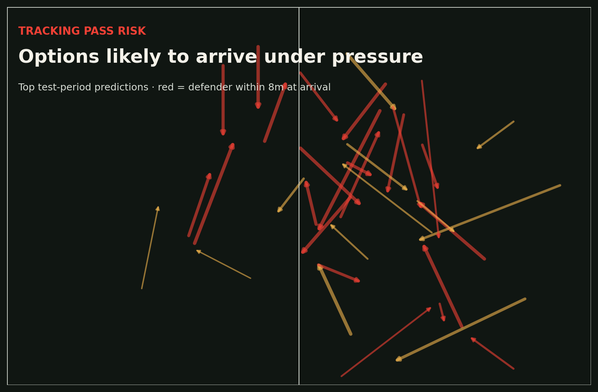

# Tracking Pass Risk

A PyTorch model that estimates whether a pass will arrive with an opponent within eight metres of the target, using synchronized player-tracking context available when the pass begins.



This is the portfolio's research-heavy project. It joins event and tracking feeds by frame, extracts interpretable spatial features, reads large tracking files in chunks, compares a neural model against a logistic baseline, and validates on the final period of the match timeline.

## Analyst question

**Before the ball is played, which options are likely to deliver the receiver directly into pressure—and why?**

The exported table preserves lane clearance, current target pressure, nearby support, team width, opponent compactness, and the observed defender distance at arrival, so high-risk predictions can be challenged against video rather than accepted as a black-box score.

## Run

```bash
python -m venv .venv
source .venv/bin/activate
pip install -e ".[dev]"
python scripts/download_open_data.py
tracking-pass-risk \
  data/raw/events.csv \
  data/raw/home.csv \
  data/raw/away.csv \
  --output artifacts
pytest
```

The training command emits a feature table with split assignments, a metrics file, a PyTorch checkpoint with feature/scaler metadata, and a test-period risk map.

## Engineering choices

- Chunked reads avoid materialising two full tracking tables when only pass frames are needed.
- Temporal validation avoids future phases leaking into the training set.
- Early stopping is selected on validation loss.
- A simple baseline is mandatory. On the demo split it narrowly beats the MLP, so the repository recommends logistic regression while retaining the PyTorch experiment and training infrastructure.
- Model, scaler statistics, and feature order are saved together to prevent serving skew.

## Data

[Metrica Sports Sample Data](https://github.com/metrica-sports/sample-data), Sample Game 1. The data is anonymised, synchronised event/tracking data. Acknowledge Metrica Sports in any public reuse.

See [`MODEL_CARD.md`](./MODEL_CARD.md) for the full target and limitations.
